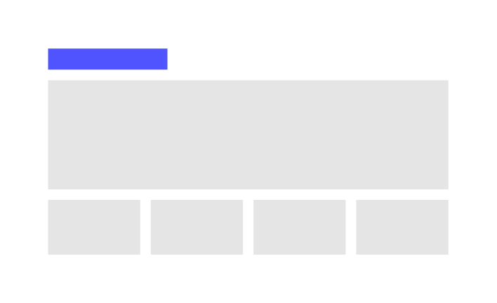
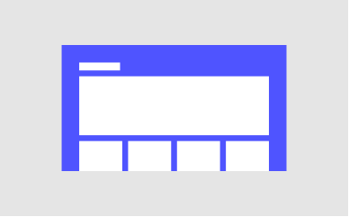
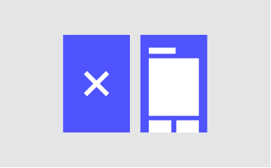
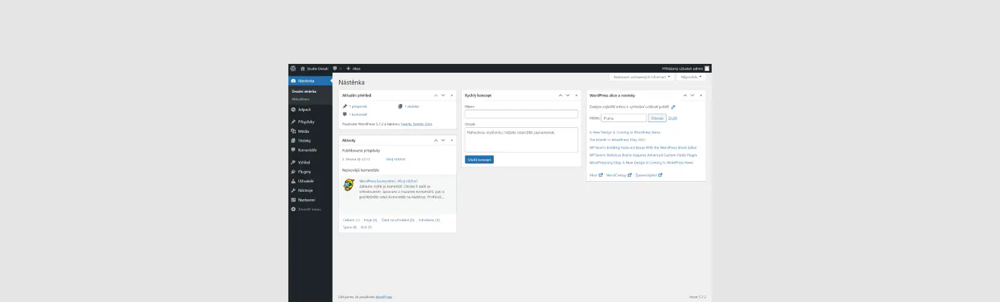
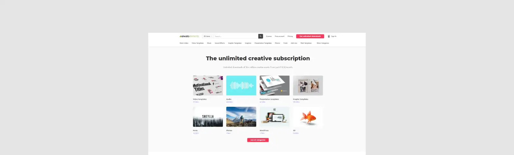
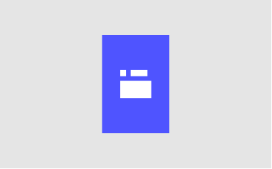
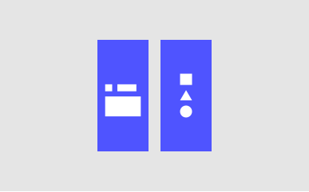

```html
<a class="log" href="https://www.studiodenali.cz/">
        <svg width="100%" height="100%" viewBox="0 0 445 67"
            style="fill-rule:evenodd;clip-rule:evenodd;stroke-linejoin:round;stroke-miterlimit:2;">
            <rect x="-0" y="-0" width="444.933" height="67.006" style="fill:#4f54ff;" />
            <text x="12.44px" y="52.368px"
                style="font-family:'Roboto';font-weight:900;font-size:53.12px;fill:#fff;">STUDIO DENALI</text>
            <path d="M419.338,14.646l11.461,18.618l-22.923,0l11.462,-18.618Z" style="fill:#fff;" />
        </svg>
    </a>
    <div class="top l">
        
        <h1 class="top-1" id="top-1"></h1>
        <p class="top-2" id="top-2"></p>
    </div>
    <div class="web s">
        
        <p class="web-2" id="web-2"></p>
    </div>
    <div class="exp s">
        
        <h1 class="exp-1" id="exp-1"></h1>
        <p class="exp-2" id="exp-2"></p>
    </div>
    <div class="upk s">
        
        <h1 class="upk-1" id="upk-1"></h1>
        <p class="upk-2" id="upk-2"></p>
    </div>
    <div class="hos s">
        
        <h1 class="hos-1" id="hos-1"></h1>
        <p class="hos-2" id="hos-2"></p>
    </div>
    <div class="wps m">
        
        <h1 class="wps-1" id="wps-1"></h1>
        <p class="wps-2" id="wps-2"></p>
    </div>
    <div class="env m">
        
        <h1 class="env-1" id="env-1"></h1>
        <p class="env-2" id="env-2"></p>
    </div>
    <div class="ema s">
        
        <h1 class="ema-1" id="ema-1"></h1>
        <p class="ema-2" id="ema-2"></p>
    </div>
    <div class="dom s">
        
        <h1 class="dom-1" id="dom-1"></h1>
        <p class="dom-2" id="dom-2"></p>
    </div>
    <div class="gra s">
        
        <h1 class="gra-1" id="gra-1"></h1>
        <p class="gra-2" id="gra-2"></p>
    </div>
    <div class="soc s">
        
        <h1 class="soc-1" id="soc-1"></h1>
        <p class="soc-2" id="soc-2"></p>
    </div>
    <div class="pri l">
        
        <h1 class="pri-1" id="pri-1"></h1>
        <p class="pri-2" id="pri-2"></p>
    </div>
    <div class="con l">
        <iframe class="con-map"
            src="https://www.google.com/maps/embed?pb=!1m18!1m12!1m3!1d82345.3866281877!2d18.457739069232826!3d49.83694566887435!2m3!1f0!2f0!3f0!3m2!1i1024!2i768!4f13.1!3m3!1m2!1s0x8bd3b80abd2e80a9%3A0x92ab1426e66238f8!2sStudio%20Denali!5e0!3m2!1scs!2scz!4v1629384930567!5m2!1scs!2scz"
            width="100%" height="100%" style="border:0;" allowfullscreen="no" loading="lazy"></iframe>
        <h1 class="con-1" id="con-1"></h1>
        <p class="con-2" id="con-2"></p>
        <h1 id="con-1" class="text-uppercase">kontaktujte nás</h1>
        <h3 id="con-2" class="fw-bold mt-32">E-mail</h3>
        <a href="mailto:jakubklapka@studiodenali.cz">
            <p class="p-clamp">jakubklapka@studiodenali.cz</p>
        </a>
        <h3 id="con-3" class="fw-bold mt-32">Telefonní číslo</h3>
        <a href="tel:+420736285455">
            <p class="p-clamp">+420 736 285 455</p>
        </a>
        <a href="jakub_klapka.vcf" download="Jakub Klapka">
            <h3 id="con-4" class="p-clamp mt-64">uložit kontakt</h3>
        </a>
    </div>
    <footer>
        <div class="footer-1">
            <svg width="100%" height="100%" viewBox="0 0 445 67"
                style="fill-rule:evenodd;clip-rule:evenodd;stroke-linejoin:round;stroke-miterlimit:2;">
                <rect x="-0" y="-0" width="444.933" height="67.006" style="fill:#fff;" />
                <text x="12.44px" y="52.368px"
            style="font-family:'Roboto';font-weight:900;font-size:53.12px;fill:#212529;">STUDIO DENALI</text>
                <path d="M419.338,14.646l11.461,18.618l-22.923,0l11.462,-18.618Z" style="fill:#212529;" />
            </svg>
        </div>
        <div class="footer-2">
            <p class="text-uppercase"><a class="copyright" href="https://cs.wikipedia.org/wiki/Autorsk%C3%A9_pr%C3%A1vo"
                    target="_blank" rel="noopener noreferrer">&copy;</a>
                <script>document.write(new Date().getFullYear())</script> Jakub Klapka & David Brzý
            </p>
        </div>
    </footer>
```