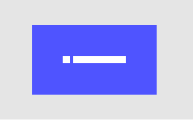
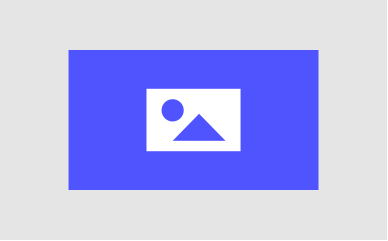

# **Read Me**
<p>Readme.md je dokument, ve kterém najdeme specifické informace k programování, jako například příkazy nebo kód, co chceme integrovat. Markdown je jednoduchý jazyk a syntax najdeme <a href="https://daringfireball.net/projects/markdown/syntax>">zde</a>.</p>

- [ ] Finální **redesign** *(Affinity)*
- [ ] MARGINSSSSSSSSSSSS!!!!!!!!!!!!!!!!!

## **html**

- [ ] fix the margins

>THEY ARE LITERALLY ALL OVER THE PLACE!

- [ ] language toggle in footer

```html
<select style="width: 65px;margin-top: 24px;" name="listlanguages" onclick="langSelectChange(this)"></select>
```

## **images**

- [ ] rasterize properly

>Trying to rasterize images in affinity didn't work, we need fix.

- [ ] e-mail


- [ ] domain

>Some of the images are not so... *great*. I need to fix them.



- [ ] graphic works



## **Safari 15 optimalisation**

> These atttributes are used for Android for a long time, but Safari with their horrible new bar and color on the top bar in iPadOS and MacOS implemented it too.

- [x] ~~theme-color~~

```html
<meta name="theme-color" content="#ffffff" media="(prefers-color-scheme: light)">
<meta name="theme-color" content="#ffffff" media="(prefers-color-scheme: dark)">
```

- [ ] safe-area

```css
html {padding-top: env(safe-area-inset-top);}
body{margin-bottom: env(safe-area-inset-bottom);}
```

## ~~**social media**~~

> This is an importnat part of any website, it makes sharing a whole more appealing.

- [x] ~~twitter:card~~

```html
<meta name="twitter:card" content="summary_large_image">
<meta name="twitter:image" content="https://idk.com/">
<meta name="twitter:creator" content="@9to5toys">
<meta name="twitter:creator" content="@9to5toys">
<meta name="twitter:label1" content="Written by">
<meta name="twitter:data1" content="Nona Porter">
```
- [x] ~~open graph (facebook)~~

>Open Graph is a standart implemented by Facebook, for example also used by iMessage.

```html
<meta property="og:url" content="https://www.studiodenali.cz/">
<meta property="og:title" content="Postaráme se o vaši přítomnost na internetu">
<meta property="og:description" content="Jsme studio, které pro vás vytvoří webové stránky a postará se o ně, ukážeme vám jak na sociální sítě, zařídíme, abyste byli v mapách a mnoho dalšího. To vše za jeden měsíční poplatek včetně domény a hostingu.">
<meta property="og:image" content="https://www.studiodenali.cz/img/og-preview.png">
```

## **overlay**

>A flawed overlay system used for displaying more information about a project without another page.

- [ ] css

```css
#over-elektra {
    position: fixed;
    display: none;
    width: 100%;
    height: 100%;
    left: 0;
    right: 0;
    bottom: 0;
    background-color: white;
    z-index: 2
}
#over-text {
    position: absolute;
    top: 50%;
    left: 50%;
    font-size: 50px;
    color: black;
    transform: translate(-50%, -50%);
    -ms-transform: translate(-50%, -50%)
}
#elektra-image:hover {
    opacity: 50%;
}
```

- [ ] html

```html
    <div id="over-elektra" class="container-fluid">
        <header>
            <div class="row">
                <div class="col d-flex justify-content-start">
                    <div class="header-logo">
                        <a href="https://www.studiodenali.cz">
                            <svg width="100%" height="100%" viewBox="0 0 387 59">
                                <rect x="0" y="0" width="387" height="58.281" style="fill:#4f54ff;" />
                                <text x="10.82px" y="45.549px"
                                style="font-family:'Roboto', sans-serif;font-weight:900;font-size:46.203px;fill:#fff;">STUDIO
                                DENALI</text>
                                <path d="M364.737,12.739l9.97,16.194l-19.939,0l9.969,-16.194Z"
                                style="fill:#fff;" />
                            </svg>
                        </a>
                    </div>
                </div>
                <div class="col d-flex justify-content-end">
                    <div class="close-btn">
                            <svg id="over-elektra.off" width="100%" height="100%" viewBox="0 0 58 58"
                                style="cursor:pointer;">
                                <rect x="0" y="0" width="58" height="58" style="fill:#4f54ff;" />
                                <g transform="matrix(1,0,0,1,15.887,15.887)">
                                <path d="M0,26.227L26.227,0"
                                style="fill:none;fill-rule:nonzero;stroke:#fff;stroke-width:7px;" />
                                </g>
                                <g transform="matrix(1,0,0,1,15.887,15.887)">
                                 <path d="M26.227,26.227L0,0"
                                style="fill:none;fill-rule:nonzero;stroke:#fff;stroke-width:7px;" />
                                </g>
                            </svg>
                        </div>
                    </div>
                </div>
            </div>
        </header>
        <main>
            <div class="row" style="margin-top: 48px;">
                <div class="col">
                    <a href="http://www.caffeclubelektra.cz/" target="_blank">
                        <iframe src="http://www.caffeclubelektra.cz/" width="100%" height="450%" scrolling="yes"frameborder="0" title="Navštívit webové stránky Caffe Club Elektra"></iframe>
                    </a>
                </div>
            /div>
        </main>
    </div>
```

- [ ] javascript

> Used for finding and replacing content.

```javascript
document.getElementById("over-elektra.on").onclick = function elektraon() { document.getElementById("over-elektra").style.display = "block"; }
document.getElementById("over-elektra.off").onclick = function elektraoff() { document.getElementById("over-elektra").style.display = "none"; }
```